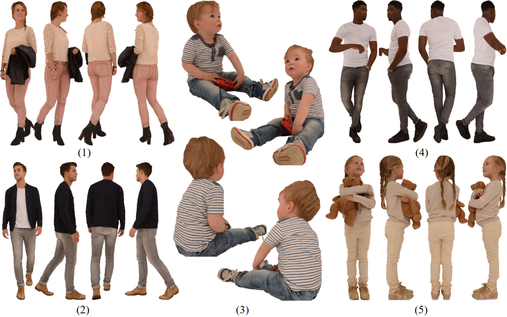
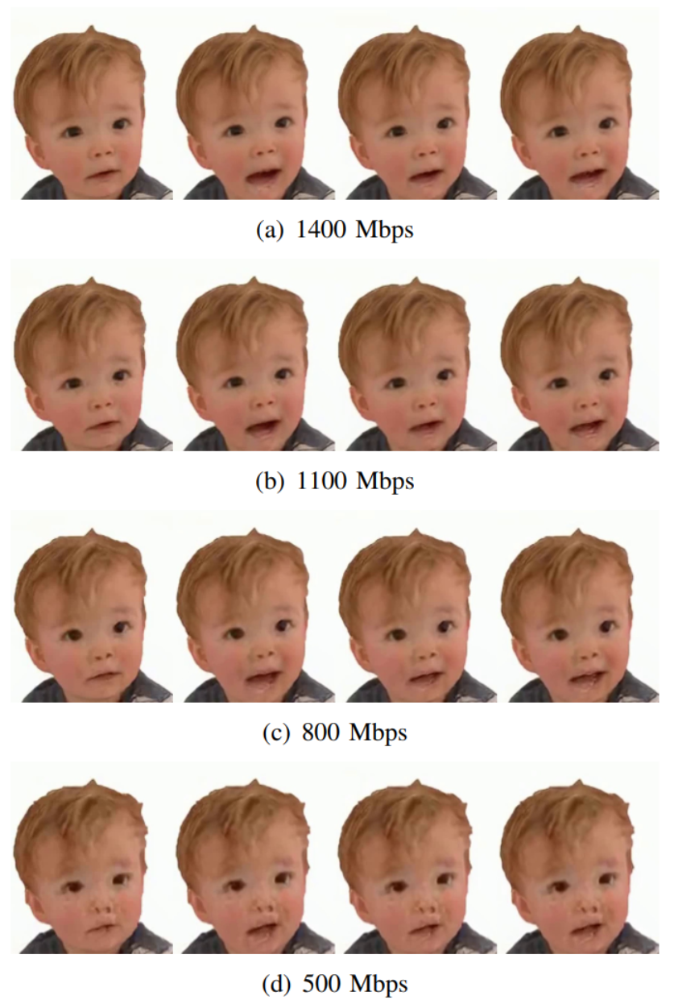

# Digital Human Quality Assessment Database in 6G Network

In order to study the transmission effect of digital human sequences in the 6G era, a dynamic digital human sequence dataset is established!

## 1. 3D Models 💡

We select five digital human models from [HumanAlloy](https://humanalloy.com/).

## 2. Samples of 6G-DHQA 📑

There're four different bitrates prepared in the database. Different models can be edited or driven by 3D software like [Maya](https://www.autodesk.com/products/maya) and [Audio2Face](https://www.nvidia.com/en-us/omniverse/apps/audio2face/).

